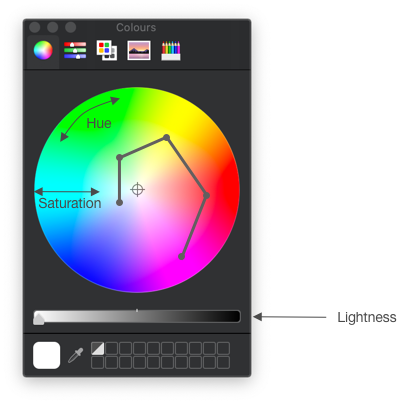
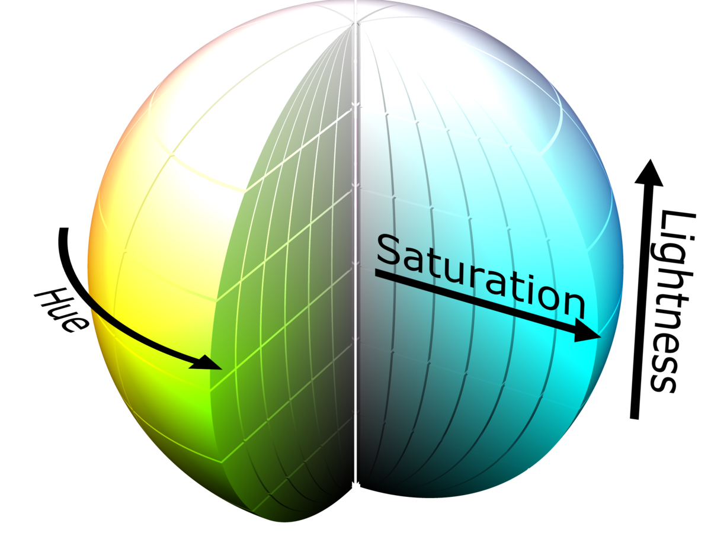
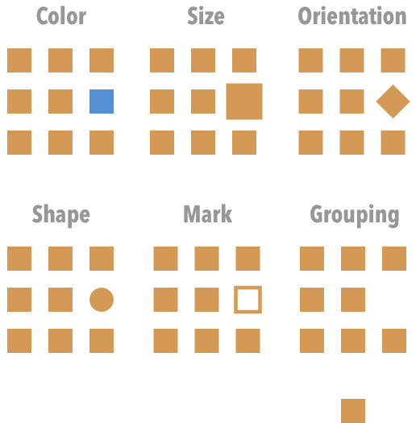
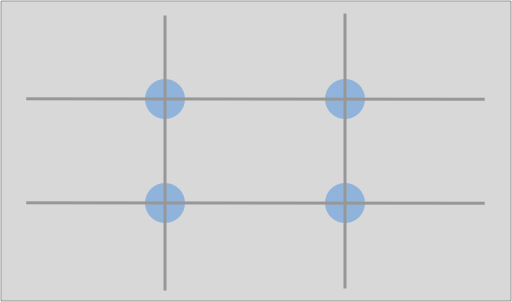
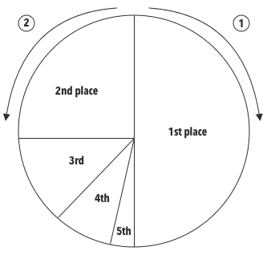

+++
title = "Data Visualization"
subtitle = ""

# Add a summary to display on homepage (optional).
summary = ""

date = 2020-02-07T11:12:09+07:00
draft = false

# Authors. Comma separated list, e.g. `["Bob Smith", "David Jones"]`.
authors = []

# Is this a featured post? (true/false)
featured = true

# Tags and categories
# For example, use `tags = []` for no tags, or the form `tags = ["A Tag", "Another Tag"]` for one or more tags.
tags = []
categories = []

# Projects (optional).
#   Associate this post with one or more of your projects.
#   Simply enter your project's folder or file name without extension.
#   E.g. `projects = ["deep-learning"]` references
#   `content/project/deep-learning/index.md`.
#   Otherwise, set `projects = []`.
# projects = ["internal-project"]

# Featured image
# To use, add an image named `featured.jpg/png` to your page's folder.
[image]
  # Caption (optional)
  caption = ""

  # Focal point (optional)
  # Options: Smart, Center, TopLeft, Top, TopRight, Left, Right, BottomLeft, Bottom, BottomRight
  focal_point = ""
+++

Scientists are expected to be effective communicators, but that can be a little
tricky without a few conscious tricks up your sleeve.

Visualization, in particular, can be a very powerful means of conveying information,
be it in your papers, posters, presentations, chapters, or blogposts.

🖍 *Nota bene*: In this post, I summarize a few recommendations from various sources
that I, personally, found very useful.
For a more in-depth take on the following and other points, do consult the series
of Points of View columns published in *Nature Methods*.
A collection of these can be found [here](https://www.scientificamerican.com/products/nature-products/nature-collections-visual-strategies-for-biological-data/).
Another great online read can be found [here]
(https://www.knowablemagazine.org/article/mind/2019/science-data-visualization).

Please note that all of these recommendations
are meant to be general and that one should always take into account any
field-specific conventions.

## Color
There are a few things to know about color.

First, color varies in terms of:

- Hue: "*the attribute we use to classify a color as red or yellow.*" [1]
- Saturation: which "*describes the neutrality of a color; a red object with
little or no white is said to be very saturated.*" [1]
- Lightness: which "*tells us about its relative ordering on the dark-to-light scale.*" [1]

Figure 1 shows a way to represent these dimensions:

Figure 1: Picking colors.

<!-- If you use these dimensions to represent color, then you end up with a three dimensional
object; for instance, a sphere: -->

<!-- 

Figure 1: HSL (hue, saturation, lightness) color solid.
 -->

Now, when picking colors, these should ideally be discernible in grayscale as well.
That way, if someone prints your figure in black and white, they still get the message 😊.
One way to do this is to spiral around the color wheel while varying lightness as well.
This only works effectively for a limited number of colors: around 6 to 8 [1].
Past 8, it just becomes harder to find discernible colors.

As for representing data, color is ill-suited to represent **quantitative data**, because it is not in principle
clear how to order different colors. It is, however, appropriate to characterize **categorical** data.

While color might make a figure seem nicer, it should be used judiciously.
Indeed, there are better strategies to compare elements, and these were ranked by
Cleveland and McGill [2]:

| Rank       | Aspect compared        |
| --------------- |:-------------- |
| 1        | Position along common scale |
| 2        | Position on the same, but non-aligned scales |
| 3        | Length |
| 4        | Angle  |
| 5        | Area |
| 6        | Volume  |
|          | Color saturation |
| 7        | Color hue |

This made me realize that bar charts are a very effective tool for comparison!

## A word on color blindness

Given that certain forms of color blindness are quite common, this is something
that you should definitely take into account. Here is a list of colors from
Bang Wong, optimized for color-blind individuals [3]:

| Color       | Color name        | RGB |
| --------------- |:-------------- | :-------------- |
| | Black | 0, 0, 0 |
| | Orange |230, 159, 0|
| | Sky blue | 86, 180, 233|
| | Blueish green | 0, 158, 115|
| | Yellow | 240, 228, 66|
| | Blue | 0, 114, 178|
| | Vermillion | 213, 94, 0|
| | Reddish purple| 204, 121, 167|

## Salience
Now that we've reviewed a few tricks of how to effectively compare elements, let's
see how to create contrast, *i.e.* visually separate one part of an image from the rest.
Salience, the visual quality of an object that makes it more prominent, can be
achieved in several ways [1]:

Figure 2: Achieving salience.

A few notes on this:

- Sometimes, it might make sense to have multiple views of the same graph, in order to
emphasize one thing at a time.
- Make sure the most salient aspect of the figure is also the most relevant!

## Gestalt principles

The Gestalt principles of perception are a set of principles which attempt
to explain why humans naturally perceive objects as being organized or grouped [5].
There are several principles [4-5]:

| Principle       | Remarks        |
| --------------- |:-------------- |
| Similarity | Similar objects are grouped together |
| Proximity | Grouping based on distance (do you see 2 rows?) |
| Connection | Lines create a clear connection and groups |
| Enclosure | Enclosure can overcome the other principles.  |

Notice how you can use enclosure to bring the reader's attention to different parts of a graph
or table!

## Layout

A layout has both an aesthetic and clarifying purpose. A simple way to organize your
slides/posters is to follow the "rule of thirds" [6].

Figure 3: Power points.

Basically, you can start by dividing the page into 9 equal parts. Objects placed
along the lines and especially at their intersection points (the so-called power
points) become more prominent. You can use this to guide the observer.

## Other

The above principles should already help a fair amount, but here are few other
tips:

- Negative space (or whitespace): use it to structure your visualization and
to let it breathe (no one likes crammed posters...). For more on this, see [7].
- Typography: favor sans serif fonts for slides and serif fonts for greater
lengths of text (*e.g.* posters, papers) [8].
- Overview figures: these can be very helpful! However, keep them simple and
avoid entering graphs or results at this point [9].
- 🧨 Pie charts: while pie charts can be useful in describing parts of a whole
and are standard practise in some fields, they have been criticized. Edward Tufte
once wrote *"the only design worse than a pie chart is several of them"* [10]. To
compare elements, pie charts rely on differences in area or angle, and we have
previously seen that there are more effective means of comparison. Hence,
a bar chart can often be a more effective alternative.
If you do opt for a pie chart, you might want to know that a specific ordering of
slices is sometimes recommended. Specifically, Bang Wong writes: *"place the largest
wedge to the right of 12 o’clock, the second largest to the left of 12 o’clock
and the remainder counter-clockwise descending in size"* [11]. Graphically:

Figure 4: Organizing a pie chart.

## References
[1] [B. Wong, "Color coding", *Nature Methods*, 7:573, 2010.](https://www.nature.com/articles/nmeth0810-573)

[2] [W. S. Cleveland, R. McGill, "Graphical Perception and Graphical Methods
for Analyzing Scientific Data", *Science*, 229(4716), 1985.](https://science.sciencemag.org/content/229/4716/828)

[3] [B. Wong, "Color blindness", *Nature Methods*, 8:441, 2011.](https://www.nature.com/articles/nmeth.1618)

[4] [B. Wong, "Gestalt principles (part 1)", *Nature Methods*, 7:863, 2010.](https://www.nature.com/articles/nmeth1110-863)

[5] [Principles of grouping, Wikipedia, [accessed on 10.02.2020]](https://en.wikipedia.org/wiki/Principles_of_grouping)

[6] [B. Wong, "Layout", *Nature Methods*, 8:783, 2011.](https://www.nature.com/articles/nmeth.1711)

[7] [B. Wong, "Negative Space", *Nature Methods*, 8:5, 2011.](https://www.nature.com/articles/nmeth0111-5)

[8] [B. Wong, "Typography", *Nature Methods*, 8:277, 2011.](https://www.nature.com/articles/nmeth0411-277)

[9] [B. Wong, "The overview figure", *Nature Methods*, 8:365, 2011.](https://www.nature.com/articles/nmeth0511-365)

[10] [E. Tufte, *The Visual Display of Quantitative Information*, 2nd edition, Graphics Press, 2001.](https://www.edwardtufte.com/tufte/books_vdqi)

[11] [B., Wang, Points of review (part 2), *Nature Methods*, 8:189, 2011.](https://www.nature.com/articles/nmeth0311-189)
