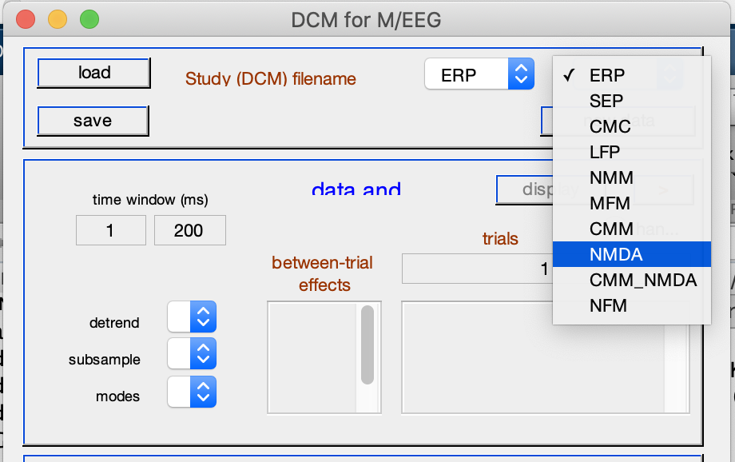

+++
title = "Dcm Types"
subtitle = ""

# Add a summary to display on homepage (optional).
summary = ""

date = 2019-04-01T12:57:43+02:00
draft = true

# Authors. Comma separated list, e.g. `["Bob Smith", "David Jones"]`.
authors = []

# Is this a featured post? (true/false)
featured = false

# Tags and categories
# For example, use `tags = []` for no tags, or the form `tags = ["A Tag", "Another Tag"]` for one or more tags.
tags = []
categories = []

# Projects (optional).
#   Associate this post with one or more of your projects.
#   Simply enter your project's folder or file name without extension.
#   E.g. `projects = ["deep-learning"]` references
#   `content/project/deep-learning/index.md`.
#   Otherwise, set `projects = []`.
# projects = ["internal-project"]

# Featured image
# To use, add an image named `featured.jpg/png` to your page's folder.
[image]
  # Caption (optional)
  caption = ""

  # Focal point (optional)
  # Options: Smart, Center, TopLeft, Top, TopRight, Left, Right, BottomLeft, Bottom, BottomRight
  focal_point = ""
+++
The literature surrounding Dynamic Causal Modelling (DCM) can quickly get quite
confusing, and one the of the things that is hard to find is a list of all the
current options one has, when one decides to model EEG or fMRI data with DCM.
Below you'll find a small list of the available DCM models with a brief description
about what distinguished them from other models. I'll also provide references to
papers you might want to check out if you wish to understand the inner workings
of these models.
Oh, and I'll also write down the model acronyms in case you are using SPM, on the
menu in the right-hand side, when opening the SPM GUI for DCM for EEG

- Neural mass models ('NMM'): nonlinear model based on a first order approximation.
  - ’NMDA’ is a variant of the ’NMM’ model which also includes a model of NMDA receptor.
  - ’CMC’ and ’CMM’ are canonical microcircuit models. You'll find, in SPM a 'CMC NMDA',
  basically incorporates a canonical microcircuit model with dedicated parameters
  for the NMDA receptor.
- Neural field models
- Mean field models (’MFM’): also nonlinear and based on second order approximation.
